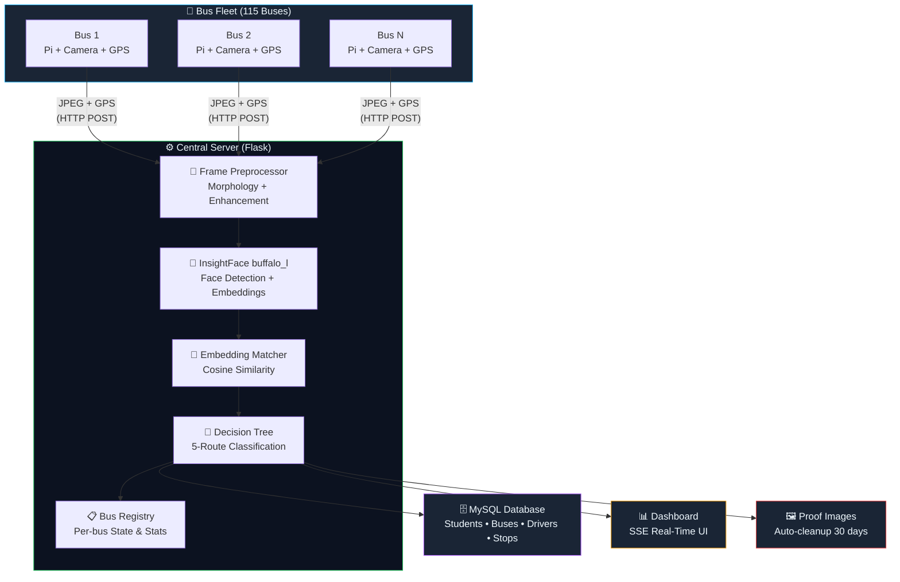
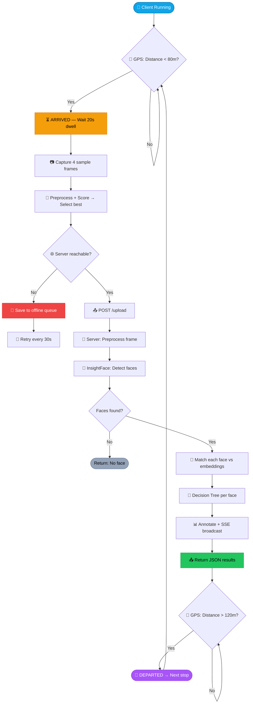
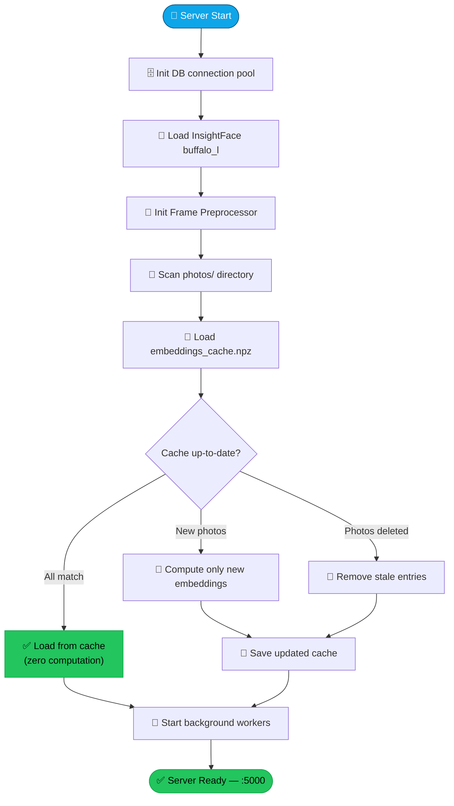
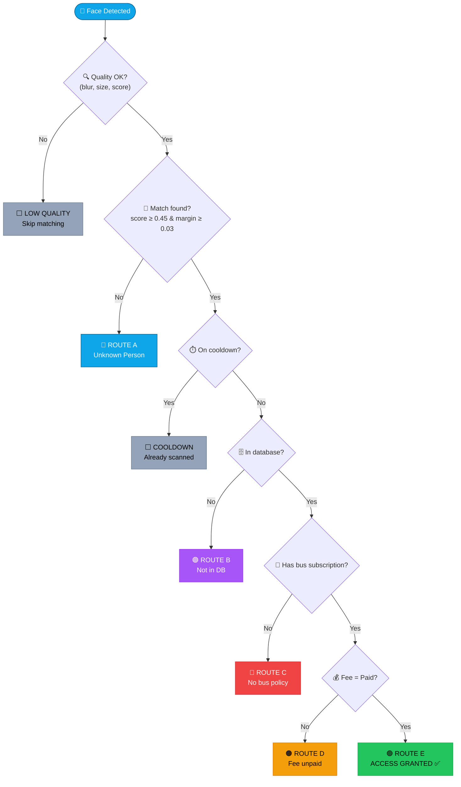
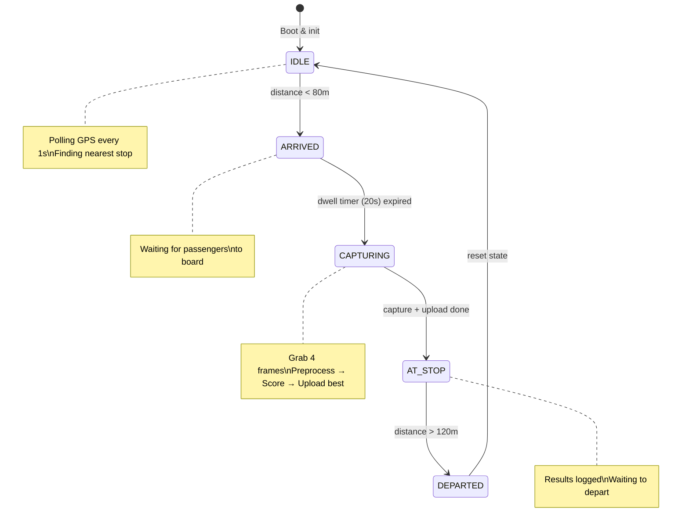
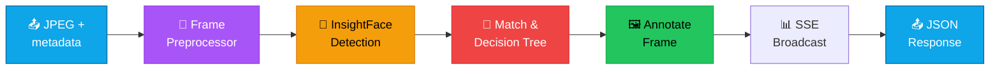
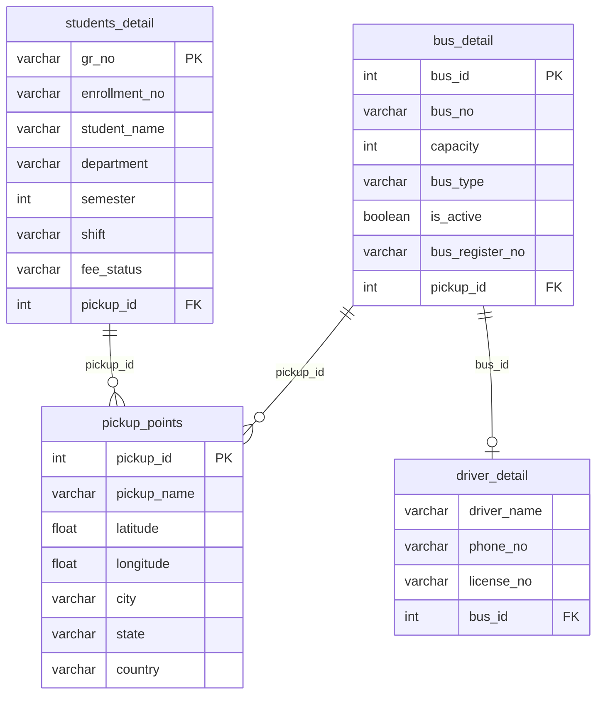

<p align="center">
  
  
  
  
  
  
</p>

<h1 align="center">🚌 TransBuddy</h1>
<h3 align="center">Multi-Bus AI Face Verification System</h3>
<p align="center"><em>Marwadi University — Server v12.0.0 | Client v12.1.0</em></p>

<p align="center">
  An AI-powered real-time face verification system for university bus transportation.<br/>
  Cameras on <strong>115+ buses</strong> capture student faces at pickup stops, verify identity<br/>
  and fee status against a central database, and grant or deny boarding — all in real time.
</p>

---

## 📑 Table of Contents

<table>
<tr>
<td width="50%">

- [🔭 Overview](#-overview)
- [✨ Key Features](#-key-features)
- [🏗️ System Architecture](#️-system-architecture)
- [🔄 Internal System Flow](#-internal-system-flow)
- [🌳 Decision Tree](#-decision-tree-face-verification)
- [📡 Client Process Flow](#-process-flow--client-side)

</td>
<td width="50%">

- [⚙️ Server Process Flow](#️-server-process-flow)
- [📂 Project Structure](#-project-structure)
- [🗄️ Database Schema](#️-database-schema)
- [🌐 API Reference](#-api-reference)
- [🛠️ Configuration](#️-configuration)
- [🚀 Installation & Deployment](#-installation--setup)

</td>
</tr>
</table>

---

## 🔭 Overview

TransBuddy automates student verification on university buses. The flow is simple:

> 🚌 **Bus arrives at stop** → 📷 **Camera captures frame** → 🧠 **AI detects & matches faces** → ✅ **Grant or deny access**

Each bus runs a **client** (Raspberry Pi or laptop) that communicates with a **central Flask server** hosting the AI model, database, and live dashboard.

---

## ✨ Key Features

<table>
<tr>
<td>🚌 <strong>Multi-Bus Support</strong></td>
<td>115 buses tracked simultaneously with independent streams & stats</td>
</tr>
<tr>
<td>🧠 <strong>InsightFace AI</strong></td>
<td><code>buffalo_l</code> model — ArcFace embeddings for robust face recognition</td>
</tr>
<tr>
<td>💾 <strong>Smart Embedding Cache</strong></td>
<td><code>.npz</code> cache avoids recomputation; auto-syncs with <code>photos/</code> folder</td>
</tr>
<tr>
<td>🔬 <strong>Frame Preprocessing</strong></td>
<td>Morphological ops, CLAHE, denoising, auto-gamma, sharpening pipeline</td>
</tr>
<tr>
<td>📍 <strong>GPS Geofencing</strong></td>
<td>Haversine-based arrival/departure detection at configured pickup points</td>
</tr>
<tr>
<td>📴 <strong>Offline Queue</strong></td>
<td>Captures saved locally when server unreachable; auto-replayed when online</td>
</tr>
<tr>
<td>📊 <strong>Real-Time Dashboard</strong></td>
<td>SSE-powered command center with live feeds, per-bus stats, and alerts</td>
</tr>
<tr>
<td>🖼️ <strong>Proof Images</strong></td>
<td>Every verification saved to disk with auto-cleanup after 30 days</td>
</tr>
<tr>
<td>⏱️ <strong>Dual Cooldown</strong></td>
<td>Morning/evening slot system prevents duplicate scans per student</td>
</tr>
<tr>
<td>🗺️ <strong>Mock GPS</strong></td>
<td>Built-in GPS simulator for testing without hardware</td>
</tr>
</table>

---

## 🏗️ System Architecture



---

## 🔄 Internal System Flow

### End-to-End Flow (Single Bus Scan)



### Embedding Initialization (Server Startup)



---

## 🌳 Decision Tree (Face Verification)

Each detected face goes through this classification:



### Route Summary

| Route | Status | API Endpoint | Color | Meaning |
|:---:|---|---|:---:|---|
| **A** | `not_uni` | `/not_uni_student` | 🔵 | Face doesn't match any enrolled photo |
| **B** | `invalid_database` | `/invalid_alerts` | 🟣 | Photo matched but GR not in DB |
| **C** | `invalid_person` | `/invalid_alerts` | 🔴 | In DB but no bus subscription |
| **D** | `valid_without_bus` | `/unpaid_students` | 🟠 | Has bus subscription, fee unpaid |
| **E** | `valid_with_bus` | `/valid_students` | 🟢 | **Access Granted** — paid & verified |

---

## 📡 Process Flow — Client Side

### Main Loop State Machine



### Client Startup Sequence

| Step | Action | Details |
|:---:|---|---|
| 1 | `ClientPreprocessor` init | Gamma, CLAHE, bilateral denoise |
| 2 | `load_stops()` | Fetch pickup points from `/pickup_points` |
| 3 | `register_bus()` | POST to `/register_bus` with bus_id |
| 4 | Start `GPSReader` | Mode: `mock` / `relay` / `manual` |
| 5 | Start `CameraManager` | Threaded capture loop (15 FPS) |
| 6 | Start `stream_thread` | Push live JPEG to `/stream_frame` every 1s |
| 7 | Start `offline_retry_thread` | Replay queued captures every 30s |
| 8 | Fetch `validated_today` | Skip already-scanned GRs this shift |
| 9 | **Enter main loop** | GPS → state machine → capture → upload |

### Client Preprocessing Pipeline

```
Raw Frame → [Brightness check] → [Contrast check] → [Noise check]
                                        │
                      All OK? ──Yes──► Pass through (zero overhead)
                         │
                        No
                         ▼
              ┌──────────────────────┐
              │  Auto-Gamma (LUT)    │  Brightness normalization
              │  CLAHE (LAB space)   │  Local contrast enhancement
              │  Bilateral Filter    │  Edge-preserving denoise
              │  Unsharp Mask (opt)  │  Sharpening
              └──────────────────────┘
```

---

## ⚙️ Server Process Flow

### Upload Processing (`POST /upload`)



### Server Preprocessing Pipeline (Morphological + Enhancement)

| Step | Operation | Trigger Condition | Purpose |
|:---:|---|---|---|
| 0 | **Auto-Gamma** | Dark (< 40) or Bright (> 220) | Brightness normalization via LUT |
| 1 | **NL-Means Denoise** | Noise stddev > 12 | Remove sensor noise |
| 2 | **Morph Opening** | Noisy frame | Erosion → Dilation (remove noise spots) |
| 3 | **Morph Closing** | Noisy or blurry | Dilation → Erosion (fill feature gaps) |
| 4 | **CLAHE** | Dark/bright/low contrast | Adaptive local contrast enhancement |
| 5 | **Unsharp Mask** | Blurry (Laplacian < 80) | Edge enhancement / sharpening |

> 💡 **Smart processing**: Quality is assessed first. Clean frames pass through with zero overhead.

---

## 📂 Project Structure

```
📦 testingpurpose/
│
├── 🐍 server.py                  # Central Flask server (2375 lines)
│                                  #   Face detection, matching, decision tree
│                                  #   Multi-bus registry, preprocessing, REST API
│
├── 🐍 face_detection_for_pc.py   # Client for laptop/Pi (1005 lines)
│                                  #   Camera, GPS, state machine, offline queue
│
├── 📁 templates/
│   └── 🌐 index.html             # Command Center dashboard (2087 lines)
│                                  #   Live feeds, stats, detection tabs, SSE
│
├── 📁 photos/                    # 105 enrolled student face images
│   ├── 120609.jpg                #   Filename = GR number
│   └── ...
│
├── 💾 embeddings_cache.npz       # Cached 512-dim face embeddings
├── 📋 requirements.txt           # Python dependencies
├── 🐳 Dockerfile                 # Production Docker image
├── 🔒 ca.pem                     # MySQL SSL cert (optional)
│
├── 📁 captures/                  # Frames sorted by verification result
│   ├── with_bus/                 #   ✅ Route E: access granted
│   ├── without_bus/              #   🟠 Route D: fee unpaid
│   ├── invalid_captures/         #   🔴 Routes B & C
│   └── not_uni_student/          #   🔵 Route A: unknown
│
├── 📁 proof_images/              # Timestamped proofs (auto-cleanup 30d)
│   └── YYYY-MM-DD/
│       ├── valid_with_bus/
│       ├── unpaid_students/
│       ├── invalid_alerts/
│       └── not_uni_student/
│
├── 📁 offline_queue/             # Queued captures (server unreachable)
├── 📄 server.log                 # Server log
└── 📄 laptop_client.log          # Client log
```

---

## 🗄️ Database Schema

### MySQL Database: `transbuddy_db_1`

#### `students_detail` — Student enrollment & fee info

| Column | Type | Description |
|---|---|---|
| `gr_no` | VARCHAR **(PK)** | GR number (matches photo filename) |
| `enrollment_no` | VARCHAR | University enrollment number |
| `student_name` | VARCHAR | Full name |
| `department` | VARCHAR | Department / faculty |
| `semester` | INT | Current semester |
| `shift` | VARCHAR | Morning / Evening |
| `fee_status` | VARCHAR | `"Paid"` or `"Unpaid"` |
| `pickup_id` | INT (FK) | Assigned pickup point |

#### `bus_detail` — Bus fleet

| Column | Type | Description |
|---|---|---|
| `bus_id` | INT **(PK)** | Unique bus identifier |
| `bus_no` | VARCHAR | Display bus number |
| `capacity` | INT | Seat capacity |
| `bus_type` | VARCHAR | AC / Non-AC |
| `is_active` | BOOLEAN | Active in fleet |
| `bus_register_no` | VARCHAR | Vehicle registration plate |
| `pickup_id` | INT (FK) | Assigned route |

#### `driver_detail` — Driver assignments

| Column | Type | Description |
|---|---|---|
| `driver_name` | VARCHAR | Driver full name |
| `phone_no` | VARCHAR | Contact number |
| `license_no` | VARCHAR | License number |
| `bus_id` | INT (FK) | Assigned bus |

#### `pickup_points` — GPS stops

| Column | Type | Description |
|---|---|---|
| `pickup_id` | INT **(PK)** | Stop identifier |
| `pickup_name` | VARCHAR | Stop name |
| `latitude` | FLOAT | GPS latitude |
| `longitude` | FLOAT | GPS longitude |
| `city`, `state`, `country` | VARCHAR | Location details |

#### ER Diagram



---

## 🌐 API Reference

### 🏠 Core

| Method | Endpoint | Description |
|:---:|---|---|
| `GET` | `/` | Dashboard (Command Center UI) |
| `GET` | `/health` | Health check + system stats |
| `POST` | `/upload` | Upload frame for face detection |
| `GET` | `/upload_status` | Latest scan result |
| `GET` | `/pickup_points` | List GPS-enabled pickup stops |
| `GET` | `/bus_location` | Latest bus GPS location |
| `GET` | `/events` | SSE stream (real-time updates) |

### 🚌 Multi-Bus

| Method | Endpoint | Description |
|:---:|---|---|
| `POST` | `/register_bus` | Register bus (loads bus + driver info) |
| `GET` | `/buses` | List all buses with status & stats |
| `POST` | `/stream_frame` | Push live JPEG from bus |
| `GET` | `/live_frame_bus?bus_id=X` | Live frame (base64 JSON) |
| `GET` | `/live_frame_bus.jpg?bus_id=X` | Live frame (raw JPEG) |

### 📊 Detection Results

| Method | Endpoint | Description |
|:---:|---|---|
| `GET` | `/valid_students` | 🟢 Access-granted students |
| `GET` | `/unpaid_students` | 🟠 Fee-unpaid detections |
| `GET` | `/invalid_alerts` | 🔴🟣 Invalid (no DB / no bus) |
| `GET` | `/not_uni_student` | 🔵 Unknown persons |
| `GET` | `/cooldown_status` | ⏱️ Active cooldowns |
| `GET` | `/validated_today` | 📋 GRs validated in current slot |

### 🔧 Management

| Method | Endpoint | Description |
|:---:|---|---|
| `POST` | `/reload_embeddings` | Re-scan photos/ & rebuild cache |
| `POST` | `/cache/clear_student` | Invalidate student DB cache |
| `GET` | `/preprocess_status` | Preprocessor config & status |
| `POST` | `/preprocess_toggle` | Enable/disable preprocessing steps |
| `POST` | `/{route}/clear` | Clear stored results per route |

---

## 🛠️ Configuration

### Server Config (`server.py`)

| Parameter | Default | Description |
|---|:---:|---|
| `CONFIDENCE_THRESHOLD` | `0.45` | Min cosine similarity for match |
| `MARGIN_THRESHOLD` | `0.03` | Min gap between top-2 matches |
| `FACE_MIN_SIDE_PX` | `36` | Min face dimension (pixels) |
| `FACE_BLUR_THRESHOLD` | `55.0` | Min Laplacian variance |
| `DB_HOST` | `localhost` | MySQL host |
| `DB_POOL_SIZE` | `10` | Connection pool size |
| `PREPROCESS_ENABLED` | `True` | Master preprocessing toggle |
| `RESULT_HOLD_SECS` | `8` | Dashboard result hold time |
| `PROOF_RETAIN_DAYS` | `30` | Auto-delete proofs after N days |

### Client Config (`face_detection_for_pc.py`)

| Parameter | Default | Description |
|---|:---:|---|
| `BUS_ID` | `115` | This bus's identifier |
| `SERVER_URL` | ngrok URL | Server URL or tunnel |
| `GPS_MODE` | `"mock"` | `mock` / `relay` / `manual` |
| `ARRIVE_RADIUS_M` | `80` | Meters to trigger arrival |
| `DEPART_RADIUS_M` | `120` | Meters to trigger departure |
| `CAPTURE_DELAY_SECS` | `20` | Wait time after arrival |
| `SAMPLE_COUNT` | `4` | Frames captured per stop |
| `CAMERA_INDEX` | `1` | OpenCV camera index |
| `STREAMING_ENABLED` | `True` | Push live frames to server |
| `CLIENT_PREPROCESS` | `True` | Client-side enhancement |

---

## 🚀 Installation & Setup

### Prerequisites

- 🐍 Python 3.10+
- 🗄️ MySQL 8.0+ (local or Aiven cloud)
- 📷 Webcam or Raspberry Pi camera

### Step 1 — Install Dependencies

```bash
cd c:\xampp\htdocs\testingpurpose
pip install -r requirements.txt
```

### Step 2 — Setup Database

Create MySQL database `transbuddy_db_1` with the tables in the [Database Schema](#️-database-schema) section. Populate `students_detail` and `pickup_points`.

### Step 3 — Add Student Photos

Place face photos in `photos/`. **Filename = GR number**:

```
photos/
├── 120609.jpg    ← GR: 120609
├── 120641.jpg    ← GR: 120641
└── ...           ← 105 students
```

### Step 4 — Start Server

```bash
python server.py
```

> Startup: DB pool → InsightFace model → Preprocessor → Embeddings → ✅ Ready on `:5000`

### Step 5 — Start Client

Edit `Config.SERVER_URL` and `Config.CAMERA_INDEX`, then:

```bash
python face_detection_for_pc.py
```

### Step 6 — Open Dashboard

Navigate to **http://localhost:5000** 🎉

---

## 🐳 Deployment (Docker)

### Build & Run

```bash
# Build
docker build -t transbuddy-server .

# Run
docker run -d -p 5000:5000 --name transbuddy \
  -e DB_HOST=your-mysql-host \
  -e DB_PASSWORD=your-password \
  transbuddy-server
```

### Production (Gunicorn)

The Dockerfile runs Gunicorn with 1 worker + 8 threads:

```
gunicorn --bind 0.0.0.0:5000 --workers 1 --threads 8 --timeout 120 server:app
```

### Health Check

```bash
curl http://localhost:5000/health
```

---

## 🧰 Technologies Used

<table>
<tr><td><strong>Component</strong></td><td><strong>Technology</strong></td></tr>
<tr><td>🧠 AI Model</td><td>InsightFace <code>buffalo_l</code> (ArcFace, ONNX Runtime)</td></tr>
<tr><td>⚙️ Backend</td><td>Python 3.11, Flask, Gunicorn</td></tr>
<tr><td>🗄️ Database</td><td>MySQL 8.0 (connection pooling)</td></tr>
<tr><td>📷 Vision</td><td>OpenCV (morphological ops, CLAHE, denoising)</td></tr>
<tr><td>🌐 Frontend</td><td>Vanilla HTML/CSS/JS, SSE, Google Fonts</td></tr>
<tr><td>🐳 Deployment</td><td>Docker, ngrok tunneling</td></tr>
<tr><td>💾 Caching</td><td>NumPy <code>.npz</code> compressed arrays</td></tr>
</table>

---

<p align="center">
  <strong>TransBuddy</strong> — Making university transport smarter with AI 🎓🚌<br/>
  <em>Marwadi University</em>
</p>
